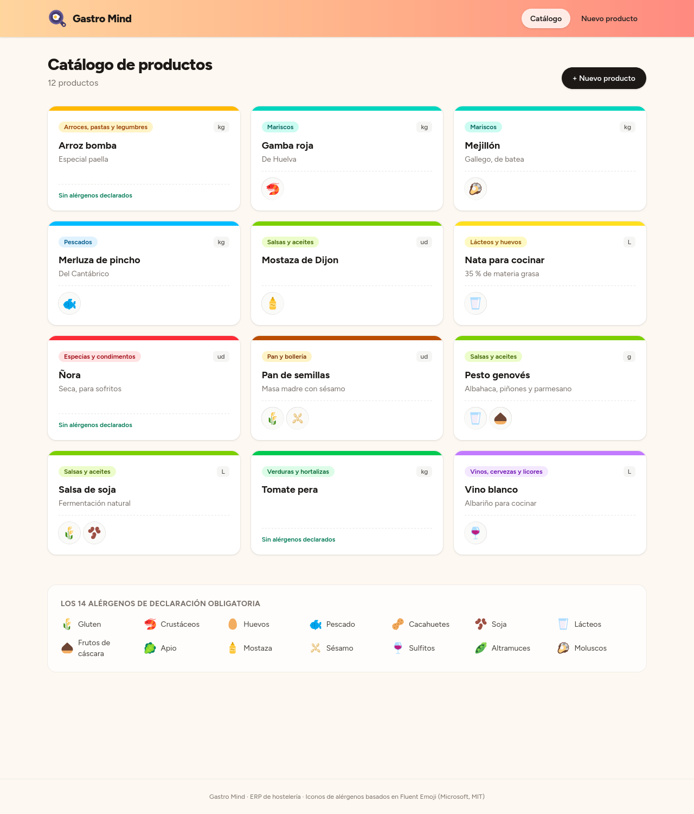

# 🍳 Gastro Mind

> ERP modular para hostelería: **productos, proveedores, albaranes, lotes, stock y
> escandallos**.
> Responde a tres preguntas de cualquier cocina: qué hay en cámara, qué hay
> que gastar primero y cuánto cuesta de verdad cada plato.



<sub>Datos de ejemplo cargados con <code>scripts/datos-ejemplo.sh</code>.</sub>

Todas las cocinas hacen escandallos, pero casi siempre con un precio medio
apuntado en un Excel que se queda viejo con la siguiente factura del proveedor.
Gastro Mind calcula el coste con lo que costó de verdad cada lote que se gasta,
y gasta primero lo que caduca antes, como en una cámara bien llevada.

Está en desarrollo y crece por funcionalidades completas: cada una atraviesa
dominio, casos de uso, API y base de datos antes de empezar la siguiente. Ya
funcionan de punta a punta, con su web, el **catálogo de productos** y la
**recepción de género**: proveedores, albaranes y lo que hay en cámara.

## Cómo calcula

Cada entrada de género es un **lote** con su caducidad y su precio de compra.
Un ejemplo con arroz bomba:

| Lote | Caduca | Compra | Coste por kg |
|---|---|---|---|
| **LOT-001** | En 5 meses | 2 kg por 20 € | 10,00 € |
| **LOT-002** | En 6 meses | 5 kg por 10 € | 2,00 € |

Una receta que necesita **4 kg** gasta primero LOT-001, que caduca antes
(2 kg × 10 € = 20 €), y completa con LOT-002 (2 kg × 2 € = 4 €). El escandallo
de ese arroz es **24 €**, no un precio medio.

- **FEFO** (*first expired, first out*): se gasta primero el lote que caduca
  antes, no el que entró antes.
- Si no hay stock suficiente, **no se toca ningún lote**: el consumo es todo o
  nada.
- Un lote **caducado no se acepta** al darlo de entrada.
- Las cantidades **llevan su unidad** y se convierten solas dentro de la misma
  magnitud: una receta que pide 200 g de un producto que se compra en kg gasta
  0,2 kg. Mezclar magnitudes (kg con unidades o manojos) es un error.
- El dinero y las cantidades van en `BigDecimal`: nada de decimales
  aproximados. El coste se calcula con el precio de cada lote **sin redondear
  por el camino** (10 € por 3 kg, gastados enteros, son 10 €, no 9,99 €); solo
  se redondea el total.

## Qué hace

- **🥕 Productos** — ficha con categoría (frescos, despensa, bebidas y no
  comestibles), unidad de medida (kg, g, L, ml, ud, manojo y ración) y los
  **14 alérgenos** de declaración obligatoria. Se guardan en PostgreSQL y se
  gestionan por API.
- **🚚 Proveedores** — nombre, CIF, teléfono y email (solo el nombre es
  obligatorio).
- **🧾 Albaranes** — cada entrega de un proveedor: número de albarán y líneas
  con producto, cantidad, importe, caducidad y lote. Registrarlo crea un lote
  por línea.
- **📦 Lotes** — cada entrada de género con su código de lote, su caducidad, su
  precio de compra y lo que queda de él.
- **🧊 Stock** — qué hay de cada producto, en qué lotes y cuándo caduca cada
  uno, y consumo FEFO.
- **📖 Recetas** — nombre, descripción, raciones e ingredientes sin productos
  repetidos.
- **💶 Escandallo** — coste de un ingrediente según los lotes que consume y
  coste total de una receta.

Recetas y escandallo viven por ahora solo en el dominio: llegarán a la API en
las próximas funcionalidades.

## Cómo entra el género

El **albarán es un documento**: dice lo que entró y no cambia. El **lote es el
stock**: se va gastando. Por eso cada línea del albarán crea un lote y guarda
una foto de lo que llegó; si mañana se gastan 2 de los 5 kg, el lote baja a 3 kg
y el albarán sigue diciendo 5 kg, como la factura del proveedor.

- Las reglas del lote valen también al recibir: nada caducado, cantidad mayor
  que cero y unidad compatible con la del producto (3000 g de merluza entran
  como 3 kg).
- Si el proveedor no da código de lote, se usa el número de albarán y la línea:
  `ALB-1234-2`.
- Un proveedor no puede repetir número de albarán (**409**). Otro proveedor sí.
- El albarán y todos sus lotes se guardan en **una sola transacción**: si falla
  una línea, no queda nada a medias.

## La web

- **🗂️ Catálogo** — una tarjeta por producto con el color de su categoría, su
  unidad y sus alérgenos como iconos, ordenado como en español.
- **🚫 Filtro por alérgenos** — tocas los que hay que evitar (uno o varios) y el
  catálogo deja solo lo que no lleva ninguno: *«Apto sin gluten y lácteos: 8 de
  12 productos»*. El filtro va en la URL (`/?sin=GLUTEN&sin=DAIRY`), así que se
  puede compartir.
- **➕ Nuevo producto** — formulario con los 14 alérgenos como fichas que se
  marcan con un toque. Si la API rechaza el producto, el formulario lo dice y
  conserva lo escrito.
- **🧾 Nuevo albarán** — proveedor, número y tantas líneas como hagan falta. Los
  decimales se escriben con coma (*2,5 kg*, *37,50 €*) y los errores de cada
  línea se explican en español.
- **🧊 Qué hay en cámara** — cada producto con su total y sus lotes, primero los
  que caducan antes, con un aviso de color: caducado, hoy o mañana en rojo,
  menos de cinco días en ámbar.
- **🚚 Proveedores** — listado y alta.
- Funciona sin JavaScript en el navegador: las páginas se generan en el
  servidor y los formularios son HTML de toda la vida.

## La API

| Método | Ruta | Qué hace | Respuesta |
|---|---|---|---|
| `POST` | `/products` | Crea un producto | **201** con su `Location`, o **400** si no es válido |
| `GET` | `/products` | Lista los productos por nombre | **200** |
| `GET` | `/products/{id}` | Consulta un producto | **200**, o **404** si no existe |
| `POST` | `/suppliers` | Crea un proveedor | **201** con su `Location`, o **400** si no es válido |
| `GET` | `/suppliers` | Lista los proveedores por nombre | **200** |
| `GET` | `/suppliers/{id}` | Consulta un proveedor | **200**, o **404** si no existe |
| `POST` | `/goods-receipts` | Registra un albarán y crea sus lotes | **201**, **400** si no es válido, **404** si falta el proveedor o un producto, **409** si el número está repetido |
| `GET` | `/goods-receipts?supplierId=&from=&to=` | Lista los albaranes con su proveedor, sus líneas y su total, del más reciente al más antiguo; los filtros son opcionales y las fechas incluyen los extremos | **200**, o **400** si `from` es posterior a `to` |
| `GET` | `/goods-receipts/{id}` | Consulta un albarán con su total y sus líneas | **200**, o **404** si no existe |
| `GET` | `/stock` | Qué hay de cada producto: total y lotes por caducidad | **200** |

- Los errores siguen el estándar **Problem Details** (RFC 9457):
  `application/problem+json` con `status`, `title` y `detail`.
- Los nombres se ordenan **como en español**: sin distinguir mayúsculas y con
  tildes y eñes en su sitio (*aceite, Nata, Ñora, Óregano*).

## Cómo está hecho

- **Java 21 + Maven multimódulo** → arquitectura hexagonal en tres módulos:
  - `domain` — entidades, value objects y servicios de dominio, sin frameworks.
  - `application` — casos de uso (`CreateProduct`, `ReceiveGoods`, `GetStock`…)
    y los puertos que necesitan (los repositorios). Java puro, sin Spring.
  - `infrastructure` — Spring Boot 4: la API REST y el adaptador de
    persistencia.
- **SQL escrito a mano con JDBC puro**: `Connection`, `PreparedStatement` y
  `ResultSet`, con transacciones explícitas y sin ORM. La base de datos repite
  las reglas importantes como red de seguridad: claves foráneas, `UNIQUE` por
  proveedor y número de albarán, y `CHECK` en las cantidades.
- **PostgreSQL 16** con migraciones **Flyway** versionadas en
  `infrastructure/src/main/resources/db/migration`.
- **`frontend/`: Astro 5 + Tailwind 4 + TypeScript** con renderizado en
  servidor (adaptador Node). Las páginas llaman a la API desde el servidor, así
  que no hace falta CORS.
- **Iconos de alérgenos** de [Fluent Emoji](https://github.com/microsoft/fluentui-emoji)
  (Microsoft, MIT), más dos dibujados a mano en el mismo estilo: mostaza y
  sésamo, que no existen en ningún set libre.
- **TDD de principio a fin**: cada regla nace de un test en rojo, y el
  historial de commits lo cuenta.
- **192 tests en el backend** (JUnit 6 + AssertJ): unitarios en el dominio y
  los casos de uso, y de integración contra un **PostgreSQL real** gracias a
  **Testcontainers**. Los nombres en español se leen como reglas del negocio:
  *«CostingService debería calcular el coste con múltiples lotes»*. En el
  front, **26 tests de Vitest**: el cliente de la API, el filtro de alérgenos,
  las caducidades, los formatos en español y el formulario de albarán.
- **Integración continua** con GitHub Actions: cada push a `main` pasa los
  tests del backend y los tests, tipos y compilación del front.

## Correrlo en local

Requisitos: Java 21, Maven, Docker y Node 22 o superior.

```sh
docker compose up -d                                          # PostgreSQL
mvn verify                                                    # tests (necesita Docker)
mvn -DskipTests package                                       # construir
java -jar infrastructure/target/infrastructure-0.0.1-SNAPSHOT.jar   # API en :8080
./scripts/datos-ejemplo.sh                                    # productos, proveedores y albaranes
```

Y en otra terminal, la web:

```sh
cd frontend
npm install
npm run dev      # http://localhost:4321
npm test         # tests
```

La web busca la API en `http://localhost:8080`. Para otra dirección, define
`API_URL`.

## Probarla

```sh
curl -i -X POST localhost:8080/products \
  -H 'Content-Type: application/json' \
  -d '{"name": "Pan de semillas", "category": "BAKERY", "unit": "UNIT", "allergens": ["GLUTEN", "SESAME"]}'

curl localhost:8080/products
curl localhost:8080/stock
```

## Lo que viene

- [x] **Catálogo de productos**: dominio, casos de uso, API y PostgreSQL.
- [x] **Recepción de género**: proveedores, albaranes que generan lotes y
  consulta del stock.
- [ ] **Web de gestión**: navegación por módulos, tablas, listado y detalle de
  albaranes, y filtros por producto.
- [ ] **Recetas y escandallo** por API, con coste por ración.
- [ ] **Producción**: cocinar una receta gasta sus ingredientes por FEFO.
- [ ] Mermas e inventario.

## Notas

- Las categorías ya separan bebidas y alcohol pensando en un futuro TPV.
- Una migración ya aplicada no se toca nunca: los cambios van en una nueva.
- El script de datos de ejemplo usa el `date` de GNU (Linux) para calcular las
  caducidades.
- La web solo acepta formularios de los dominios de `security.allowedDomains`
  (`frontend/astro.config.mjs`). Al desplegarla, hay que añadir el dominio real.


